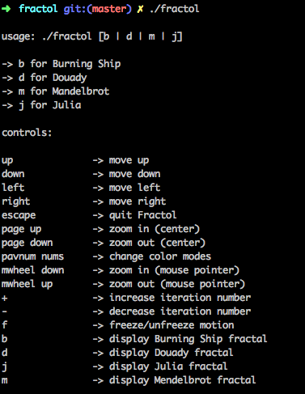
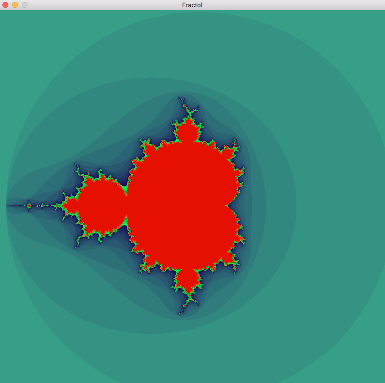

# fractol
  
Projet Ecole 42
  
### Synopsis
  
Fractol est un petit logiciel d’exploration [fractale](https://fr.wikipedia.org/wiki/Fractale).  
### Fonctionnalités :
- 4 fractales proposées : Mandelbrot, Julia, Douady, Burning Ship
- possibilité des faire varier avec la souris (sans clic) les paramètres de Julia/Douady
- zoom/dézoom sur la position actuelle de la souris grace à la molette
- recentrer l'image sur la position du clic de la souris
- déplacement avec les touches directionelles
- plusieurs palettes de couleurs
  

